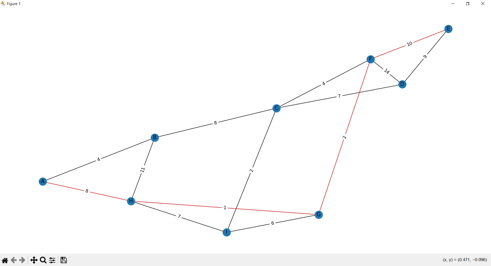

# Dijkstra's Shortest Path Visualization

This Python program demonstrates Dijkstra's algorithm for finding the shortest path in a graph. It uses NetworkX and Matplotlib for visualization.

## Features

- **Graph Representation**: Adjacency matrix.
- **Dijkstra's Algorithm**: Computes the shortest path.
- **Visualization**: Highlights the shortest path in red.

## Installation

Install the required libraries using pip:

```sh
pip install -r requirements.txt
```
## Usage

- Clone the repository or copy the code.
- Run the program:

```sh
python dijkstra_visualization.py
```
- Enter the source and destination nodes (A-I) when prompted.

## Code Summary

### Graph Class

- Initialization: Sets up the graph with a specified number of vertices.
- Dijkstra's Algorithm: Computes shortest paths.
- Visualization: Displays the graph with the shortest path highlighted.

### Main Function

- Initializes the graph.
- Takes user input for source and destination.
- Runs Dijkstra's algorithm.
- Visualizes the graph.

### Example

```sh
$ python dijkstra_visualization.py
Available nodes:
0: A
1: B
2: C
3: D
4: E
5: F
6: G
7: H
8: I
Enter the source node (A - I): A
Enter the destination node (A - I): E
Shortest Path from A to E:
A -> H -> G -> F -> E
The weight is: 21

```




